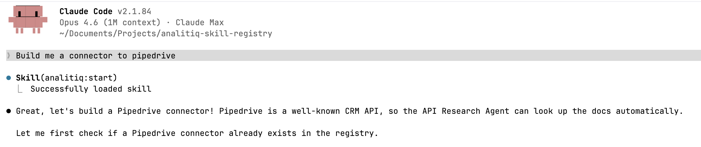

[](https://github.com/analitiq-dip-registry/postgres/releases)
[](LICENSE)

# PostgreSQL

Open-source relational database management system (RDBMS) known for reliability, feature robustness, and performance. PostgreSQL supports advanced data types, full ACID compliance, and extensibility, making it a popular choice for web applications, analytics, and geospatial workloads.

## What is this?

This is a **connector** -- a configuration that defines how to authenticate with PostgreSQL and what data is available for reading and writing. It does not move data by itself. Instead, it is used by the [Analitiq](https://analitiq-app.com) data integration platform or the open-source [Analitiq Engine](https://github.com/analitiq-ai/analitiq-engine) to set up data pipelines.

## How to use this connector

There are two ways to use this connector:

### Option 1 -- Analitiq Cloud (no setup required)

All connectors from this registry are automatically available on [analitiq-app.com](https://analitiq-app.com). Simply log in, select the connector, and follow the on-screen instructions to connect your database.

### Option 2 -- Open Source (self-hosted)

All connectors are open source and free to use. To get started:

1. Clone the [analitiq-engine](https://github.com/analitiq-ai/analitiq-engine) repository
2. Install the Claude plugin `analitiq-plugin-dataflow`
3. Launch Claude in the root directory of `analitiq-engine`
4. Tell it: *"I need to move data from X to Y"*

The `analitiq-plugin-dataflow` plugin will automatically fetch the required connectors from the [Analitiq DIP Registry](https://github.com/analitiq-dip-registry) and set up the data flow pipeline for you.

## Prerequisites

- A running PostgreSQL server (version 12 or later recommended)
- A database user account with appropriate permissions for the tables you need to access
- Network access from the Analitiq platform to your PostgreSQL server
- If using `verify-ca` or `verify-full` SSL, the CA certificate that issued your server certificate

## Authentication

PostgreSQL uses standard database credentials (username and password) to authenticate, with optional TLS.

| Input | Required | Notes |
|---|---|---|
| `host` | yes | Hostname or IP address of the server |
| `port` | yes | Defaults to `5432` |
| `database` | yes | A session addresses one database; pick the one to replicate |
| `username` | yes | |
| `password` | yes | Stored as a secret |
| `ssl_mode` | no | libpq vocabulary; defaults to `prefer` |
| `ssl_ca_certificate` | no | PEM-encoded CA bundle; required for `verify-ca` / `verify-full` |

### How to get your credentials

1. Log in to your PostgreSQL server as an administrator
2. Create a dedicated user for the integration (recommended):
   ```sql
   CREATE USER analitiq_user WITH PASSWORD 'your_secure_password';
   ```
3. Grant the necessary privileges on the target database:
   ```sql
   GRANT CONNECT ON DATABASE your_database TO analitiq_user;
   GRANT USAGE ON SCHEMA public TO analitiq_user;
   GRANT SELECT ON ALL TABLES IN SCHEMA public TO analitiq_user;
   ```
4. Note the host address, port (default 5432), database name, username, and password
5. If your server requires certificate verification, obtain the CA certificate from your database administrator

### SSL modes

The connector exposes PostgreSQL's own `sslmode` vocabulary:

| Mode | Behaviour |
|---|---|
| `disable` | Never use SSL |
| `allow` | Plaintext first, SSL as fallback |
| `prefer` | SSL first, plaintext as fallback (**default**) |
| `require` | SSL only; verifies the CA if one is supplied |
| `verify-ca` | SSL only, verify the issuing CA |
| `verify-full` | Verify the CA **and** that the hostname matches the certificate |

## Transports

The connector ships two transports and uses ADBC by default:

- **`database` (ADBC, default)** -- the first-class `adbc-driver-postgresql` driver. Reads and writes Arrow buffers directly and bulk-loads via PostgreSQL's native `COPY` protocol, so there is no row-by-row path.
- **`sqlalchemy`** -- `postgresql+asyncpg`, used as the engine-side SQL and metadata path.

Both transports receive the SSL mode and the CA certificate.

Tables and views are discovered at runtime from `information_schema`; the `information_schema`, `pg_catalog`, and `pg_toast` schemas are excluded automatically.

## Type mapping

Types are converted through `definition/type-map.json`: its `read` section (PostgreSQL to Arrow) and `write` section (Arrow to PostgreSQL DDL). Notable cases:

| PostgreSQL | Arrow | Why |
|---|---|---|
| `NUMERIC(p,s)` within Arrow's range | `Decimal128` / `Decimal256` | Precision preserved as declared |
| `NUMERIC` unconstrained, or `p > 76`, or `scale > precision`, or negative scale | `Utf8` | Arbitrary precision (up to 131072 digits) and `NaN`/`Infinity` have no exact Arrow decimal; text is lossless |
| `TIMESTAMP` | `Timestamp` (no zone) | Zoneless on the wire |
| `TIMESTAMPTZ` | `Timestamp(..., UTC)` | Stored internally as UTC; the originating zone is not retained |
| `TIME WITH TIME ZONE` | `Time32` / `Time64` | **The UTC offset is dropped** -- Arrow has no time-with-offset type |
| `INTERVAL` | `Utf8` | Stores months, days and microseconds independently; not a fixed-length duration |
| `JSON`, `JSONB` | `Json` | |
| arrays (`integer[]`, ...) | `Json` | |
| enum / composite (`USER-DEFINED`) | `Utf8` | Enum declaration order is not preserved |
| `MONEY` | `Utf8` | Fraction digits depend on the server's `lc_monetary` |
| geometric, network, range, text-search, `reg*` types | `Utf8` | Rendered in their PostgreSQL text form |
| `OID` | `UInt32` | Unsigned four-byte integer |

Writing back, `Json` / `Object` / `List` all render as `JSONB`, and `UInt64` renders as `NUMERIC(20, 0)` because it exceeds `bigint`'s range. `Duration` renders as `TEXT` rather than `INTERVAL`: because `INTERVAL` reads back as `Utf8` (see the table above), rendering `Duration` as `INTERVAL` would make a re-created destination table change its own column types on every cycle.

## Write behaviour

- **Upserts** use `INSERT ... ON CONFLICT (...) DO UPDATE`, which is available on all supported PostgreSQL versions.
- **Staging** uses a real (non-temporary) table in the target schema, created with `CREATE TABLE ... (LIKE target INCLUDING DEFAULTS)`. Constraints and indexes are deliberately not copied — a stage needs neither, and a copied `UNIQUE` constraint would reject the very rows the upsert exists to resolve. PostgreSQL DDL is transactional, so staging rides inside the write transaction.
- **Bulk load** on the ADBC transport uses native Arrow ingest over `COPY`.
- Errors are classified from PostgreSQL `SQLSTATE` codes, so the engine can distinguish retryable failures (deadlocks, serialization failures) from permanent ones (constraint violations, authentication errors).

## Limitations

- **SSL mode defaults to `prefer`**, which attempts an encrypted connection but falls back to unencrypted if the server declines. Set `require` or higher to forbid that fallback; `verify-ca` or `verify-full` is recommended for production.
- **`time with time zone` loses its offset** on read (see [Type mapping](#type-mapping)). Use `timestamptz` if the offset matters.
- **Unconstrained `NUMERIC` arrives as text**, not a decimal. This is deliberate -- PostgreSQL allows far more precision than any Arrow decimal can hold -- but downstream consumers must cast if they need arithmetic.
- **Catalog addressing is not supported.** A PostgreSQL session can only see its own database, so replicating across databases requires one connection per database.
- **Schema access** -- the user must have `USAGE` privilege on each schema they need to reach. By default only `public` is accessible.
- **No rate limits** -- this is a direct database connection, so no API limits apply. Heavy queries may still affect database performance.

## Upgrading to 2.0.0

Version 2.0.0 changes how several types are converted. If you have existing pipelines, the following columns will change type downstream:

- `OID` columns move from `Int64` to `UInt32`.
- Unconstrained `NUMERIC`/`DECIMAL` columns move from a fixed `Decimal128(38, 9)` to `Utf8`. The previous fixed precision silently truncated values that exceeded it.
- `NUMERIC(p,s)` declarations outside Arrow's legal range (including `scale > precision`) now resolve to `Utf8` instead of producing an invalid decimal type.
- On the write side, `UInt64` now renders as `NUMERIC(20, 0)` instead of `BIGINT`, which previously overflowed for values above 9223372036854775807. Existing target tables created as `BIGINT` will not match the new declared type.

`Duration` now writes as `TEXT` instead of `INTERVAL`, so that the read and write maps converge.

**CA pinning works on the `sqlalchemy` transport only.** The uploaded `ssl_ca_certificate` is applied there. It cannot reach the default ADBC transport: the libpq ADBC driver rejects every `adbc.postgresql.*` database option with `NOT_IMPLEMENTED` before any network I/O, and libpq's own `sslrootcert` expects a filesystem path, which a stored PEM secret cannot supply. Under ADBC, `verify-ca` and `verify-full` fall back to libpq's default CA lookup at `~/.postgresql/root.crt`. Select the `sqlalchemy` transport when you need to pin a CA.

## For AI agents

This connector includes `CLAUDE.md` and `AGENTS.md` files -- machine-readable references used by AI agents and agentic frameworks. They document authentication types, caveats, and connection details for programmatic use. Both files are kept identical -- `CLAUDE.md` is for Claude Code, `AGENTS.md` is for other agent frameworks.

## Create a connector to any system

You can create a new connector to any API or database using Claude and the Analitiq connector builder plugin:

1. Install [Claude Code](https://claude.ai/code)
2. Install the connector builder plugin:
   ```
   claude plugin add analitiq-dip-registry/analitiq-plugin-connector-builder
   ```
3. Launch Claude and say: *"I want to create a connector for [system name]"*
4. The plugin will interview you about the system, research its API documentation, and generate the full connector with all required files

No coding required -- the plugin handles authentication research, endpoint schema generation, and file creation automatically.



## Contributing

All connectors in this registry are community-maintained and live at [github.com/analitiq-dip-registry](https://github.com/analitiq-dip-registry). To add new endpoints or improve an existing connector, install the [connector builder plugin](https://github.com/analitiq-dip-registry/analitiq-plugin-connector-builder) and follow its instructions.

## Links

- [PostgreSQL Documentation](https://www.postgresql.org/docs/current/)
- [Analitiq Cloud](https://analitiq-app.com)
- [Analitiq Engine (open source)](https://github.com/analitiq-ai/analitiq-engine)
